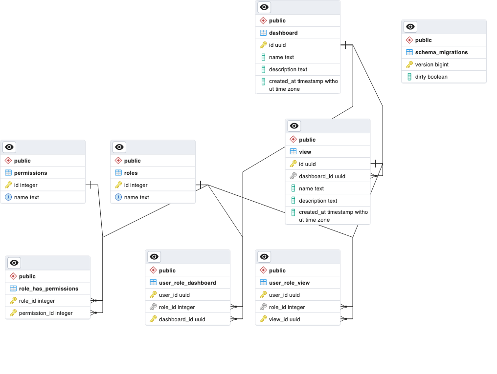
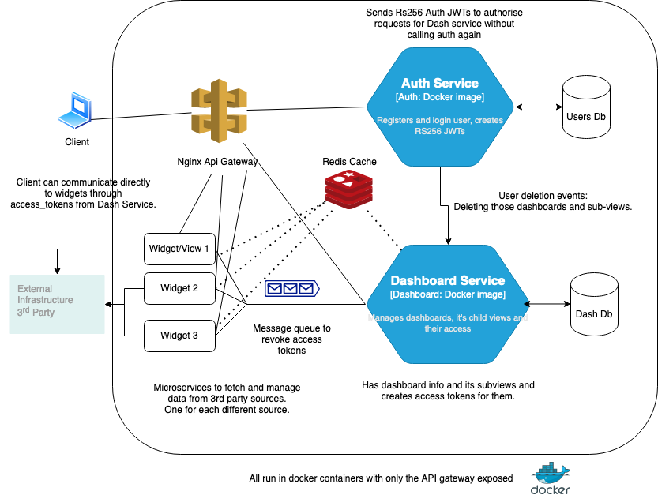

### Running Instructions

- Run `docker-compose up` to start the application. The application will be available at `http://localhost:8080`

  > Version was `Docker version 20.10.20, build 9fdeb9c`

- **Script demo of apis is at `/script/basic.go`. It is recommended to to run this script using `go run ./script/basic.go` as it covers all the use cases**. Need to do `go mod download` to download the dependencies before.

- Docs can be found at [/doc/index.html](./doc/index.html).

### Features

- Divided into two microservices: auth-service and dashboard-service
- Auth service is responsible for authentication and authorization
- Dashboard service is responsible for fetching data from the database and returning it to the client
- RS256 based JWT is used to authorize requests on the dashboard service with the help of auth.
- Both services have their individual databases.
- An nginx api gateway is used to route requests to the appropriate service.
- redis is used as a cache for the dashboard service. Though there is not much to cache, it is used to demonstrate the use of redis.
- Migration is done using go-migrate.
- Docs generated using apidoc.

### Relevant details

- A Dashboard has multiple "views". Each view at the moment has some basic details but can be thought of as a dashboard widget whose content may be fetched through a different microservice.
- Each user can have one role wrt to a dashboard as well as a view. A role can have multiple permissions.
- A user with read permission on dashboard may not have read permission on a view. In such a case, the view will not be returned to the user.

```
views: [
    {
        "name: "view1",
        "description": "view1 description",
        "type": "view1 type",
        "service_name": "view1.service.name",
        "access_token": "view1_access_token"
    }
]
```

### Database Schema



### Architecture


